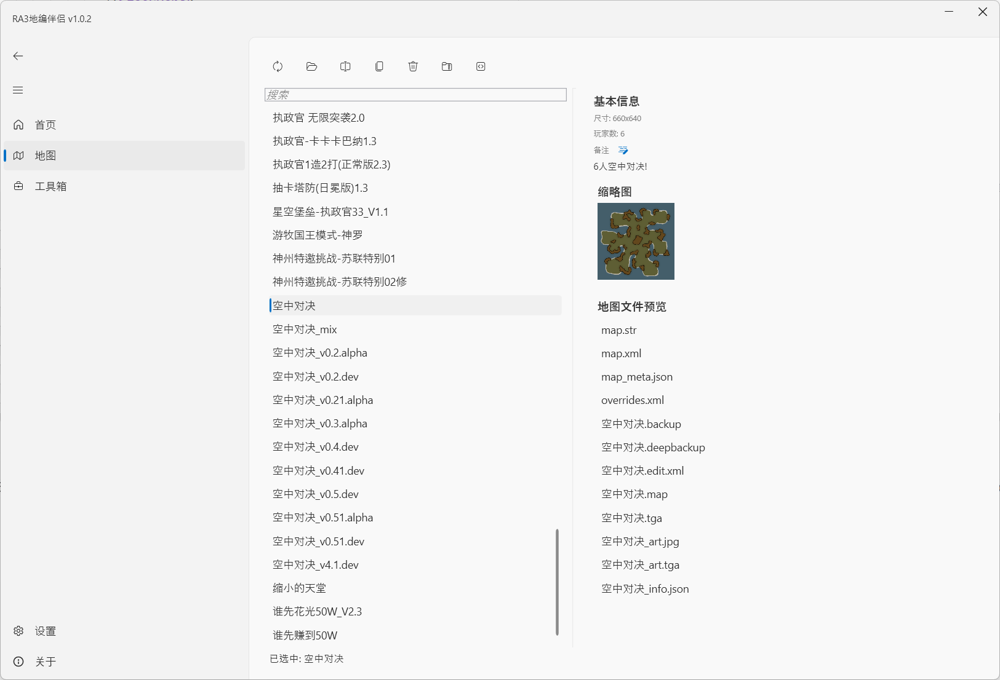

# RA3地编伴侣 | RA3MapUtils
RA3地编伴侣是一款用于辅助RA3地图制作的工具, 搭配"新地编"更佳.

## 功能
- 管理地图(包含地图的拷贝, 重命名, 删除等)
- **lua快速导入工具**
- 自动更新
- 一键设置地图的显示名称 (尚未发布)
- map.str编辑器(开发中)

## 社区
QQ群 513118543 (工具问题反馈交流)  
QQ群 613550502 (物佬的地图群, 大佬云集的地方)  

## 软件教程
[wiki(地编百科)](https://www.yuque.com/muzeqaq/ra3mapwiki/ofa6ufyd9pmwwgnm)  
[B站(简介及教学视频)](https://space.bilibili.com/6979174)

## 软件截图

